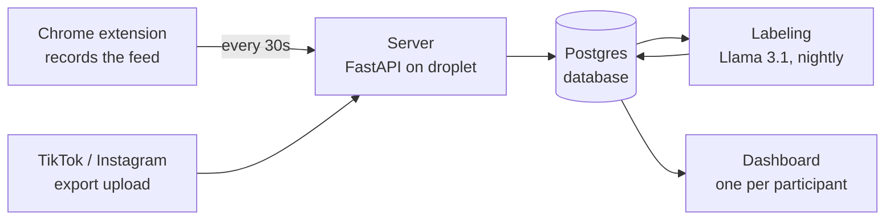

# Algorithm Mirror: How It Works

Algorithm Mirror shows people what their social feeds put in front of them, and how that compares to what they actually engage with. A Chrome extension records the feed, a server stores it, an AI model labels each post by topic and tone, and each participant gets a private dashboard.

*Last updated: Sep 24, 2026*

---

## 1. The big picture

Data moves in one direction: browser → server → labels → dashboard.

1. The **extension** records posts as you scroll and saves them on your computer.
2. Every 30 seconds it sends them to the **server** (a DigitalOcean droplet).
3. The server stores them in a **Postgres database**.
4. Every night at 2am, **labeling** runs on Jonah's laptop and tags each new post with a topic and a tone.
5. The **dashboard** reads the database and shows each participant their own data.

---

## 2. What each platform collects

Every record is one of two kinds:

- **Shown**: the feed put it on your screen
- **Engaged**: you liked, saved, upvoted, or watched it

The dashboard's main charts use **shown** data only. Engaged data is used for the "Shown vs. engaged" comparison.

| Platform | Shown | Engaged | How engaged data gets in |
|---|---|---|---|
| YouTube | Home feed on the computer | Watch history, any device | History sync every 3 hrs |
| Reddit | Home feed on the computer | Upvotes + saves, any device | History sync every 3 hrs |
| X | For You feed on the computer | Likes + bookmarks, any device | History sync every 3 hrs |
| LinkedIn | Home feed on the computer | Reactions, computer only | Recorded when you click Like |
| Instagram | Viewed posts (export) | Likes + saves (export), new saves (sync) | Upload + history sync |
| TikTok | Watch history (export) | Likes (export) | Upload only |

**Phone activity** shows up as engagement, because likes, saves, and watch history belong to your account, not your device. What a phone feed *showed* you is only captured for TikTok and Instagram, through the export upload. Uploads keep the **last 60 days** only.

---

## 3. The extension

The extension does four things:

1. **Record.** On each supported site, it watches posts enter and leave the screen. A post counts as "shown" once half of it is visible in the tab you're looking at. It saves the post's ID, title, author, whether it's an ad, its position in the feed, and how long it was on screen.
2. **Store locally.** Everything goes into the browser's own storage first, so nothing is lost if the internet drops.
3. **Sync.** Every 30 seconds, unsent records go to the server in batches of 50. The server ignores duplicates.
4. **History sync.** Every 3 hours while Chrome is open, it opens YouTube history, Reddit, X likes and bookmarks, and Instagram in background tabs, reads your likes, saves, and history, then closes them. It keeps scrolling until it reaches items it already sent, so a long gap (like a weekend with the laptop closed) still gets caught up.

Each install gets a random ID (a "token"), never a name or email. Joining with a study code links that token to a participant.

### Extension files (`extension/`)

| File | What it does |
|---|---|
| `manifest.json` | Chrome's settings for the extension: which sites it runs on, which files load, permissions |
| `config.js` | The server address. The one place to change it. |
| `db.js` | Saves records in the browser's local storage until they're synced |
| `youtube.js` | How to find and read a post on YouTube |
| `reddit.js` | Same, for Reddit |
| `x.js` | Same, for X |
| `linkedin.js` | Same, for LinkedIn. Also records a reaction when you click Like. |
| `instagram.js` | Instagram setup (history sync only, no live feed) |
| `core.js` | Shared recording logic: watches posts on screen and times them. Works with any platform file above. |
| `sync.js` | Sends unsent records to the server every 30 seconds |
| `history.js` | Reads likes, saves, upvotes, and watch history during the 3-hour sync |
| `background.js` | Schedules the 3-hour sync, opens and closes its tabs, shows the red "!" until you join |
| `popup.html` / `popup.js` | The window when you click the icon: join with a code, open your dashboard, upload TikTok or Instagram data |

**Adding a platform** = write one new file like `x.js` and list it in `manifest.json`. Everything else is shared.

---

## 4. The server

The server is a small Python app (FastAPI) on a DigitalOcean droplet, with a Postgres database. It's reached over HTTPS through Caddy, a web server that handles the security certificate for free. It shares the droplet with Jonah's other project without touching it, and costs nothing beyond the droplet's flat monthly price.

What it does:

- Receives synced data from the extension (`/sync`)
- Serves the dashboard and the upload page
- Answers the dashboard's questions (topic mix, top channels, daily counts, and so on)
- Handles joining with a study code
- Backs up the database every night at 3:30am (kept 14 days)

### Server files (`server/`)

| File | What it does |
|---|---|
| `main.py` | The app itself: receives syncs, serves the dashboard, answers all dashboard data requests |
| `participants.py` | Joining the study with a code, and looking up a participant's code and phase |
| `participants.sql` | Creates the participants table and the view that tags each record with its study phase |
| `make_codes.py` | Generates study codes like `P04-7KQX` |
| `uploads.py` | The TikTok/Instagram upload page: accepts a file, lists your uploads, deletes an upload |
| `exports.py` | Reads TikTok and Instagram export files and turns them into records (last 60 days only) |
| `enrich_tiktok.py` | Looks up the caption and creator for each TikTok video, since exports only include links |
| `label_v3.py` | The current labeler (V3). Tags each post with a topic and a tone. |
| `schema.sql` | Creates the main tables |
| `gold_todo.csv` | The 60-post answer key used to measure labeling accuracy |
| `analysis.sql` | Handy queries for checking and comparing labels |
| `export.py` | Dumps one person's data to a JSON file |
| `label.py` | The old V2 labeler, kept for comparison |
| `diagnose.py` | One-off script used to find why V2 over-labeled "gaming" |
| `patch_engaged.py` | One-off patch script from earlier; safe to delete |
| `requirements.txt` | Python packages the server needs |

### Dashboard files (`dashboard/`)

| File | What it does |
|---|---|
| `index.html` | The dashboard |
| `upload.html` | The TikTok/Instagram upload page |

### Database tables

| Table | What's in it |
|---|---|
| `items` | One row per post or video: platform, title, author, ad or not. Shared by everyone who saw it. |
| `impressions` | One row per time someone saw or engaged with a post: who, which post, when, how long, shown or engaged, where it came from (live, history sync, or export) |
| `item_labels_comparison` | Topic and tone for each post, by labeler version |
| `gold_labels` | The 60-post answer key |
| `participants` | Study codes, which token joined with each, and phase dates |

---

## 5. Labeling

Each post gets one **topic** and one **tone** from **Llama 3.1 8B**, an AI model that runs locally through Ollama on Jonah's laptop. Only the post's title and author are used. The model gets two separate questions per post (topic, then tone) and can only answer from the fixed lists below.

**Topics:** sports, politics, gaming, technology, entertainment, news, health, science, finance, crime, lifestyle, education, other

**Tones:** neutral, positive, negative, outrage, humor

Labels are stored per post, not per person. A post that five people saw gets labeled once.

### Accuracy (60-post answer key)

| Version | Topic | Topic (clear-cut posts) | Tone | Wrongly called "gaming" |
|---|---|---|---|---|
| V1 | 48.3% | 51.4% | 61.7% | 4 |
| V2 | 40.0% | 48.6% | 51.7% | 24 |
| **V3 (current)** | **76.7%** | **89.2%** | **60.0%** | **3** |

V3's fix was labeling one post at a time with strict rules and examples, instead of batching many posts per request. Topic is reliable. Tone is rough, and the dashboard says so.

### When it runs

- Every night at **2am** through Windows Task Scheduler on Jonah's laptop (plugged in, Ollama running).
- It labels only posts that don't have a label yet, for everyone at once.
- Until it runs, new posts show as **"unlabeled"** on the dashboard. Counts and channels show up right away; topics and tone show up the next morning.
- Speed: about 4 seconds per post. Fine up to about 10 participants. Past that, the plan is to move labeling to a cloud service running the same model (Groq).

---

## 6. The dashboard

Each participant opens it from the extension's popup ("Open my dashboard"). The link includes their private token, so it only shows their data.

- **Top line:** their study code and phase, plus "Data synced X ago · Topic labels updated X ago"
- **Overview tab:**
  - Three headline cards with the most striking facts (for example, "42% of your YouTube feed is sports")
  - Totals: items shown, share that were ads, items engaged with, platforms tracked
  - Feed mix: each platform's topic breakdown as a bar
  - Shown vs. engaged: what each feed pushed next to what the person actually liked, saved, or watched, with the biggest gap called out
- **One tab per platform:**
  - Topics shown, tone breakdown
  - Shown vs. engaged for that platform
  - Top channels or accounts
  - Items shown per day
- **Upload page:** add or delete TikTok and Instagram exports

---

## 7. Participants and privacy

**Joining:**

1. Get the extension zip and a study code (like `P03-LHZG`) from Jonah.
2. Unzip it and keep the folder somewhere permanent, like Documents.
3. Go to `chrome://extensions`, turn on **Developer mode**, click **Load unpacked**, and pick the `extension` folder.
4. Pin the icon, click it, enter the code, and click **Join study**.
5. Stay logged in to YouTube, Reddit, X, and LinkedIn in that Chrome, and browse normally.

**Updating:** when Jonah sends a new zip, replace the old folder with the new one and click ↻ on `chrome://extensions`. The code and data carry over.

**Privacy rules:**

- The server never stores names. People are a code plus a random token.
- The list of who has which code lives only in Jonah's private sheet, never on the server.
- Never collected: passwords, messages, comments you write, anything you post, other websites.
- Raw TikTok/Instagram export files are read once and never saved. Only the extracted records are kept.
- Participants can see everything collected about them on their dashboard, and can delete their uploads.
- Dashboard links are private. Don't share them.

---

## 8. Known limits

- **Phone feeds aren't captured** for YouTube, Reddit, X, or LinkedIn, only what people engaged with there. No app can read another app's screen on iPhone.
- **History-sync items are dated when they're synced**, not when the person liked them (the platforms don't show that date). A new participant's first day has a small spike of engagement.
- **History sync needs Chrome open.** It catches up when Chrome reopens.
- **Instagram likes can't be synced live.** Instagram blocks it, so likes come from the export only.
- **LinkedIn** has no post IDs, so posts are identified by author + text. Its engagement is reactions clicked on the computer only. We don't open LinkedIn in background tabs, because LinkedIn actively detects automation and participants need their accounts for job hunting.
- **About half of TikTok videos in an export are deleted or private** and can't be labeled.
- **No "career" topic.** LinkedIn career posts mostly land in "finance."
- **Tone is about 60% accurate.** Treat it as a rough signal.
- **Sites change their layouts.** X, LinkedIn, and Instagram especially can break capture until the matching platform file is updated.
